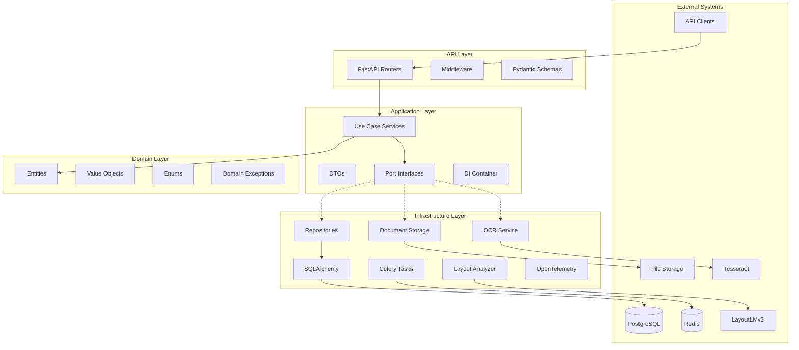
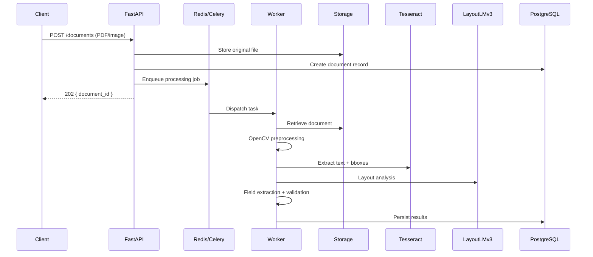

# Architecture

## Overview

IntelliClaim Extractor follows **Clean Architecture** with strict dependency inversion. Inner layers (Domain, Application) never depend on outer layers (Infrastructure, API).



## Layer Responsibilities

| Layer | Responsibility | Dependencies |
|-------|---------------|--------------|
| **Domain** | Business entities, value objects, rules | None |
| **Application** | Use cases, orchestration, port definitions | Domain only |
| **Infrastructure** | DB, OCR, ML, storage, messaging adapters | Application ports, Domain |
| **API** | HTTP, auth, validation, serialization | Application, Infrastructure config |

## Dependency Injection

The `Container` class wires infrastructure adapters at application startup. Services receive port interfaces, not concrete implementations:

```
FastAPI lifespan → Container.wire(repositories, services) → Route handlers use Container
```

## Document Processing Pipeline (Planned)



## Project Structure

```
src/intelliclaim/
├── api/                    # HTTP interface
│   ├── dependencies/       # FastAPI DI
│   ├── middleware/         # Request ID, logging, errors
│   ├── routers/            # Route handlers
│   └── schemas/            # API request/response models
├── application/            # Use cases
│   ├── container.py        # DI container
│   ├── dto/                # Data transfer objects
│   ├── interfaces/         # Port definitions (repos, services)
│   └── services/           # Application services
├── domain/                 # Pure business logic
│   ├── entities/
│   ├── enums/
│   ├── exceptions/
│   └── value_objects/
├── infrastructure/         # External adapters
│   ├── config/
│   ├── database/
│   ├── logging/
│   └── observability/
└── workers/                # Celery background tasks
```

## Key Design Decisions

1. **Async-first**: FastAPI + async SQLAlchemy for I/O-bound document operations.
2. **Port/Adapter pattern**: OCR, layout analysis, and storage are swappable behind interfaces.
3. **UUID identifiers**: All primary keys use UUIDs for distributed system compatibility.
4. **Structured logging**: JSON logs with `request_id` and `document_id` correlation.
5. **Fail-fast validation**: Domain exceptions map to standardized HTTP error envelopes.
