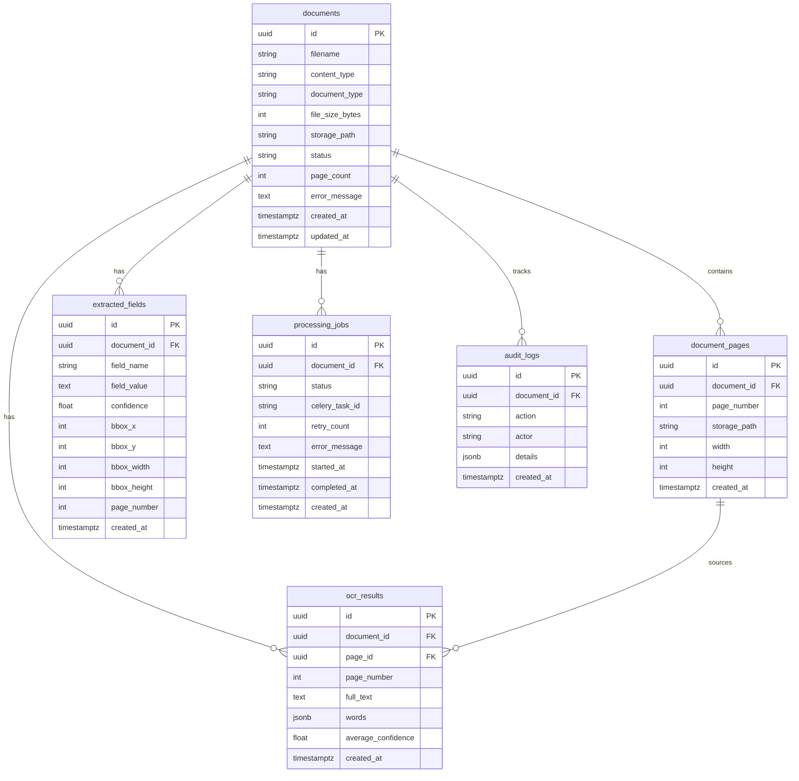

# Database Schema

PostgreSQL 16 with async SQLAlchemy 2.0 and Alembic migrations.

## Entity Relationship



## Tables

| Table | Purpose |
|-------|---------|
| `documents` | Uploaded file metadata and processing status |
| `document_pages` | Per-page preprocessed images |
| `ocr_results` | Tesseract output with word-level bounding boxes (JSONB) |
| `extracted_fields` | Structured insurance claim fields |
| `processing_jobs` | Celery async job tracking |
| `audit_logs` | Compliance and operational audit trail |

## Indexes

- `documents`: `status`, `created_at`
- `document_pages`: `document_id`, unique `(document_id, page_number)`
- `ocr_results`: `document_id`, `(document_id, page_number)`
- `extracted_fields`: `document_id`, `(document_id, field_name)`
- `processing_jobs`: `document_id`, `status`, `celery_task_id`
- `audit_logs`: `document_id`, `created_at`, `action`

## Migrations

```bash
# Apply all migrations
alembic upgrade head

# Create new migration (after model changes)
alembic revision --autogenerate -m "description"

# Rollback one revision
alembic downgrade -1
```

Initial migration: `alembic/versions/20250609_0001_initial_schema.py`

## Repository Layer

Domain entities are mapped to ORM models via `infrastructure/database/mappers.py`. Repository adapters in `infrastructure/repositories/` implement application port interfaces and are wired at startup through `infrastructure/bootstrap.py`.
